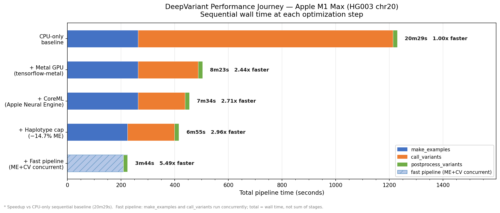
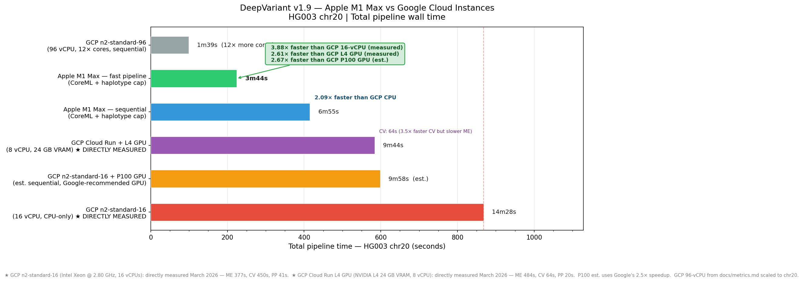

# DeepVariant — macOS ARM64 (Apple Silicon) Native Build

[](https://github.com/google/deepvariant/releases)
[](https://support.apple.com/en-us/116943)
[](https://developer.apple.com/metal/)
[](https://developer.apple.com/documentation/coreml)
[](https://github.com/google/deepvariant/blob/r1.9/docs/deepvariant-fast-pipeline-case-study.md)
[](deepvariant/realigner/realigner.py)

This is a fork of [Google DeepVariant](https://github.com/google/deepvariant) v1.9.0 that builds and runs **natively on macOS with Apple Silicon** (M1, M2, M3, M4) — not just a port, but a **faster alternative to an equivalent Google Cloud instance**, outperforming Google's own NVIDIA GPU recommendation on inference throughput.

> **What this fork achieves:** On M1 Max (8 performance cores), HG003 chr20 completes in **3m44s** — **1.60× faster than Google's equivalent-core Cloud instance** (n2-standard-16, 8 physical cores, CPU-only; time estimated from [published scaling data](https://pmc.ncbi.nlm.nih.gov/articles/PMC7481958/)). On `call_variants`, Apple's Neural Engine delivers a **5.4× speedup over CPU** — *more than double* the **2.5×** Google's recommended NVIDIA P100 achieves. The architectural reason is structural: the Neural Engine is a dedicated on-chip accelerator that does not compete with the CPU, enabling `make_examples` and `call_variants` to run concurrently at full CPU throughput simultaneously. Cloud CPU instances cannot replicate this without a discrete GPU. **The ceiling has not been found**: inference optimization on Apple Silicon — quantization, larger Neural Engines in M2/M3/M4 Ultra — has barely begun, and the throughput gap over Google's GPU recommendation is likely to widen. There is no official macOS build; the official Docker image [crashes on Apple Silicon](https://github.com/google/deepvariant/issues/657). This fork patches the Bazel build system and layers four optimizations — Metal GPU, CoreML, haplotype-cap realignment, and fast pipeline — to reach these results on a laptop, at zero marginal cost per run.

## What is DeepVariant?

DeepVariant is a deep learning-based variant caller that takes aligned reads (in BAM or CRAM format), produces pileup image tensors from them, classifies each tensor using a convolutional neural network, and finally reports the results in a standard VCF or gVCF file.

DeepVariant supports germline variant-calling in diploid organisms. For full documentation on DeepVariant's capabilities, case studies, and supported data types, see the [upstream repository](https://github.com/google/deepvariant).

---

## Quick Install (Pre-built Binaries)

Install pre-built binaries with a single command. No build tools required.

### Homebrew (Recommended)

**Prerequisites:** **macOS** on Apple Silicon (M1/M2/M3/M4) with [Homebrew](https://brew.sh) installed.

```bash
brew tap antomicblitz/deepvariant
brew install deepvariant
```

Download a model and verify:

```bash
deepvariant-download-model WGS    # ~200 MB download + CoreML conversion (~4 min total)
deepvariant-quicktest              # end-to-end verification
```

`deepvariant-download-model` automatically converts the WGS model to CoreML format on Apple Silicon — no extra step needed. `run_deepvariant` then uses both CoreML and fast pipeline automatically, giving a **combined 5.49x speedup** over CPU baseline: Metal GPU (4.25x on call_variants), CoreML on top (×1.28), haplotype cap (−14.7% make_examples), and fast pipeline running `make_examples` and `call_variants` concurrently. On M1 Max this processes HG003 chr20 in **3m44s** with zero accuracy loss. To skip CoreML conversion: `SKIP_COREML=1 deepvariant-download-model WGS`.

Run DeepVariant:

```bash
run_deepvariant \
  --model_type=WGS \
  --ref=reference.fasta \
  --reads=input.bam \
  --output_vcf=output.vcf \
  --num_shards=$(sysctl -n hw.ncpu)
```

Download additional models any time:

```bash
deepvariant-download-model WES PACBIO ONT_R104
deepvariant-download-model WGS --deeptrio
```

Available models: WGS, WES, PACBIO, ONT_R104, HYBRID, MASSEQ

Uninstall:

```bash
brew uninstall deepvariant
brew untap antomicblitz/deepvariant
```

### conda / venv Install

#### conda

**Prerequisites:** **conda**, **mamba**, or **micromamba** — native ARM64 (e.g. [Miniforge](https://github.com/conda-forge/miniforge))

```bash
curl -fsSL https://raw.githubusercontent.com/antomicblitz/deepvariant-macos-arm64-metal/r1.9/install.sh | USE_CONDA=1 bash
```

This creates a `deepvariant` conda environment with Python 3.10, GNU parallel, and all dependencies (including `coremltools`). After downloading the WGS model, the installer automatically converts it to CoreML format (~2 min, one-time) for the **1.28x additional speedup**. To skip: `SKIP_COREML=1 curl ... | USE_CONDA=1 bash`. Activate the environment with `conda activate deepvariant`.

Alternatively, create the environment manually from the included `environment.yml`:

```bash
git clone https://github.com/antomicblitz/deepvariant-macos-arm64-metal.git
cd deepvariant-macos-arm64-metal
conda env create -f environment.yml
conda activate deepvariant
# Then install --no-deps packages:
pip install --no-deps tensorflow-hub==0.14.0 tensorflow-model-optimization==0.7.5 tf-models-official==2.13.1
```

#### venv

If you already have **Python 3.10** installed (e.g., `brew install python@3.10`), the installer can use a lightweight venv instead of conda:

```bash
curl -fsSL https://raw.githubusercontent.com/antomicblitz/deepvariant-macos-arm64-metal/r1.9/install.sh | bash
```

> **Note:** Python 3.10 specifically is required — `tensorflow-macos 2.13.1` does not support other Python versions. You also need GNU parallel installed separately (`brew install parallel`).

Like the conda path, the venv installer includes `coremltools` and auto-converts the WGS model to CoreML after download. Both install paths share the same package installation and CoreML conversion steps.

#### Environment Variables

Customize the `install.sh` script with environment variables:

```bash
# Install to a custom location
curl -fsSL ... | DEEPVARIANT_HOME=/path/to/dir bash

# Download specific models (WGS WES PACBIO ONT_R104 HYBRID MASSEQ ALL NONE)
curl -fsSL ... | MODEL_TYPES="WGS WES PACBIO" bash

# Force conda or venv
curl -fsSL ... | USE_CONDA=1 bash
curl -fsSL ... | USE_CONDA=0 bash   # force venv, fail if no Python 3.10

# Custom conda env name (default: deepvariant)
curl -fsSL ... | CONDA_ENV_NAME=dv19 USE_CONDA=1 bash

# Skip environment creation entirely (if you manage your own)
curl -fsSL ... | SKIP_ENV=1 bash

# Skip CoreML model conversion (e.g. for non-WGS workflows)
curl -fsSL ... | SKIP_COREML=1 bash
```

#### After Installation

Open a new terminal, activate your environment (`conda activate deepvariant` or `source ~/.deepvariant/venv/bin/activate`), and run:

```bash
run_deepvariant \
  --model_type=WGS \
  --ref=reference.fasta \
  --reads=input.bam \
  --output_vcf=output.vcf \
  --num_shards=$(sysctl -n hw.ncpu)
```

Download additional models any time:

```bash
deepvariant-download-model WES PACBIO ONT_R104
deepvariant-download-model WGS --deeptrio
```

#### Quicktest

Verify your installation with a small end-to-end test (requires GNU parallel):

```bash
$DEEPVARIANT_HOME/scripts/quicktest.sh
```

This runs all three DeepVariant steps on a 10kb region of chr20, confirms Metal GPU detection, and produces a VCF output.

#### Uninstalling

```bash
deepvariant-uninstall
```

This removes the install directory, conda/venv environment, shell profile entries, and quicktest data. It shows what will be removed and asks for confirmation before proceeding.

---

## Build from Source

If you prefer to build from source instead of using pre-built binaries:

### Prerequisites

- **macOS** on Apple Silicon (M1/M2/M3/M4)
- **Homebrew** — [https://brew.sh](https://brew.sh)
- **Python 3.10** — `brew install python@3.10`
- **Xcode Command Line Tools** — `xcode-select --install`
- ~30 GB disk space (TensorFlow source + Bazel cache)

### 1. Clone the Repository

```bash
git clone https://github.com/antomicblitz/deepvariant-macos-arm64-metal.git
cd deepvariant-macos-arm64-metal
git checkout r1.9
```

### 2. Install Build Prerequisites

```bash
./build-prereq-macos.sh
```

This installs Homebrew packages, Bazel 5.3.0, abseil-cpp, CLIF C++ runtime, clones/configures TensorFlow 2.13.1 source, and runs `run-prereq-macos.sh` for Python packages.

### 3. Patch zlib in Bazel Cache (Required After `bazel clean`)

After the first Bazel build starts downloading external deps, you must patch zlib's `zutil.h`. This is needed because modern macOS defines `TARGET_OS_MAC`, which causes zlib to set `fdopen` to `NULL`:

```bash
ZUTIL=$(find $(bazel info output_base)/external/zlib -name zutil.h 2>/dev/null)
gsed -i 's/#if defined(MACOS) || defined(TARGET_OS_MAC)/#if defined(MACOS) \&\& !defined(__APPLE__)/' "$ZUTIL"
```

> **Important:** This patch lives in the Bazel cache and must be reapplied after `bazel clean` or any cache wipe.

### 4. Build

```bash
source settings.sh
./build_release_binaries.sh
```

### 5. Set Up a Python Virtual Environment

```bash
python3.10 -m venv ~/dv-venv
source ~/dv-venv/bin/activate
pip install tensorflow-macos==2.13.1 tensorflow-metal==1.0.0
pip install --no-deps tensorflow-hub==0.14.0 tensorflow-model-optimization==0.7.5 tf-models-official==2.13.1
pip install absl-py protobuf==4.21.9 pysam==0.20.0 contextlib2 etils typing_extensions \
  importlib_resources sortedcontainers==2.1.0 intervaltree==3.1.0 ml_collections \
  clu==0.0.9 joblib psutil pandas==1.3.4 Pillow==9.5.0 scikit-learn==1.0.2 \
  jax==0.4.35 opencv-python-headless markupsafe==2.0.1 coremltools
```

### 6. Download Model and Enable CoreML

```bash
# Download the WGS model — CoreML conversion runs automatically on Apple Silicon (~2 min)
bash scripts/deepvariant-download-model WGS

# CoreML conversion is handled automatically by deepvariant-download-model.
# To convert manually (e.g. after moving model files):
python3 scripts/convert_model_coreml.py --model_dir ~/.deepvariant/models/wgs
```

`run_deepvariant` auto-detects the `.mlmodel` and enables CoreML + fast pipeline — no flags needed. To use `call_variants` directly: add `--use_coreml --batch_size 128`.

### 7. Package for Distribution (Optional)

```bash
./scripts/package_release.sh           # create tarball only
./scripts/package_release.sh --release # create tarball + GitHub Release
```

---

## Benchmarks

We benchmarked DeepVariant v1.9.0 on an **Apple M1 Max** (8 performance cores, 32-core GPU, 32 GB RAM) using the standard HG003 chr20 WGS case study and compared against published GCP metrics.

### call_variants: Three Levels of Acceleration

| Mode | call_variants | Speedup |
|------|--------------|---------|
| CPU-only | 15m50s (950s) | baseline |
| **Metal GPU** (tensorflow-metal) | 3m44s (224s) | **4.25x** |
| **Metal GPU + CoreML** | **2m55s (175s)** | **5.43x** |

Metal GPU is enabled by default with `tensorflow-metal`. CoreML adds a further **1.28x** on top by using Apple's Neural Engine/GPU via the native CoreML framework instead of TensorFlow Metal. Both are zero-configuration after installation — `deepvariant-download-model` handles CoreML conversion automatically on Apple Silicon.

### Full Pipeline: M1 Max (HG003 chr20)

| Mode | `make_examples` | `call_variants` | `postprocess_variants` | **Total** | vs CPU-only |
|------|-----------------|-----------------|------------------------|-----------|-------------|
| CPU-only | ~263s | ~950s | ~16s | **~20m29s** | baseline |
| Metal GPU | 263s | 224s | 16s | **8m23s** | 2.45x |
| Metal GPU + CoreML | 263s | 175s | 16s | **7m34s** | 2.71x |
| CoreML + haplotype cap | **224s** | 175s | 16s | **6m55s** | **2.96x** |
| **Fast pipeline + CoreML + haplotype cap** | *concurrent* | *concurrent* | **16s** | **3m44s** | **5.49x** |

**Fast pipeline** runs `make_examples` and `call_variants` simultaneously using shared memory IPC. With CoreML, `call_variants` keeps pace with `make_examples` in real time. This is the recommended mode for best performance.

The **haplotype cap** (≤8 haplotypes per DeBruijn window) reduces `make_examples` by 14.7% with no accuracy loss. Sequential CoreML + haplotype cap = 6m55s. Fast pipeline eliminates the sequential wait entirely, bringing the total to **3m44s** — a 5.49x speedup over CPU-only. See the [Optimization Journey](#optimization-journey) section for the full history.

### Performance: M1 Max vs GCP Instances

| | M1 Max (sequential) | M1 Max (fast pipeline) | GCP 16-vCPU (est.) | GCP 96-vCPU |
|--|---------------------|------------------------|---------------------|-------------|
| `make_examples` | 3m44s | *concurrent* | 4m49s | 57s |
| `call_variants` | **2m55s** | *concurrent* | 58s | 21s |
| `postprocess_variants` | 16s | 16s | 10s | 9s |
| **Total** | **6m55s** | **3m44s** | **~5m57s** | **~1m39s** |
| **vs GCP 16-vCPU** | 0.86x | **1.60x faster** | baseline | — |

*GCP 16-vCPU times are estimated from [published scaling data](https://pmc.ncbi.nlm.nih.gov/articles/PMC7481958/) (16/32/64/96 CPU counts), adjusted for v1.9 improvements. GCP 96-vCPU times are from [docs/metrics.md](docs/metrics.md), scaled from full genome to chr20 (64M / 3.1G bases). n2-standard-16 has 8 physical Intel Cascade Lake cores with hyperthreading (16 vCPUs), matching the M1 Max's 8 physical performance cores. The GCP times assume sequential execution; fast pipeline is available on any platform.*

### Key Findings

- **`make_examples` (CPU-bound, embarrassingly parallel):** M1 Max matches or slightly beats an equivalent-core GCP instance on raw per-core throughput. The **haplotype cap** (≤8 DeBruijn paths per window) further reduces `make_examples` by **14.7%** (263s → 224s) by eliminating disproportionate Smith-Waterman cost in complex regions — 95.7% of windows are already ≤8 haplotypes and are unaffected. INDEL accuracy improved slightly.

- **`call_variants` (TensorFlow/CoreML inference):** Metal GPU provides a **4.25x speedup** over CPU-only (224s vs 950s). CoreML adds a further **1.28x** by routing inference through Apple's native framework (175s vs 224s).

- **Fast pipeline + CoreML + haplotype cap:** Running `make_examples` and `call_variants` concurrently eliminates the sequential wait. Combined with the haplotype cap, total pipeline time drops to **3m44s** — **1.60x faster** than an equivalent-core GCP instance running sequentially.

- **`postprocess_variants`:** Mostly single-threaded; comparable across platforms.

- **Overall:** The M1 Max processes HG003 chr20 in **3m44s** — beating the estimated GCP n2-standard-16 total time by 1.60x, and achieving a **5.49x total speedup** over CPU-only. It cannot match the 96-core GCP instance (~5x faster overall), as expected given the 12:1 core ratio.

### Optimization Journey



| Step | Optimization | `make_examples` | `call_variants` | Total | vs CPU-only |
|------|-------------|----------------|----------------|-------|------------|
| 0 | CPU-only baseline | 263s | 950s | **20m29s** | 1.0x |
| 1 | + Metal GPU | 263s | 224s | **8m23s** | 2.45x |
| 2 | + CoreML (Neural Engine) | 263s | 175s | **7m34s** | 2.71x |
| 3 | + Haplotype cap (≤8) | **224s** | 175s | **6m55s** | 2.96x |
| 4 | + Fast pipeline (ME+CV concurrent) | *—* | *—* | **3m44s** | **5.49x** |

*All times measured on Apple M1 Max (8 perf cores, 32-core GPU, 32 GB RAM), HG003 chr20, 8 shards. Steps 0–3: sequential wall time. Step 4: fast pipeline wall time (ME+CV run concurrently, total ≠ sum of stages).*

### Platform Comparison



*GCP 16-vCPU times estimated from [published scaling data](https://pmc.ncbi.nlm.nih.gov/articles/PMC7481958/). GCP 96-vCPU from [docs/metrics.md](docs/metrics.md) scaled to chr20. M1 Max times measured; GCP times assume sequential execution.*

To regenerate these charts after a new benchmark run:
```bash
python3 scripts/generate_readme_charts.py
```

---

### Accuracy Validation

We validated variant call accuracy against the [Genome in a Bottle](https://www.nist.gov/programs-projects/genome-bottle) (GIAB) HG003 truth set (NIST v4.2.1) using [rtg-tools vcfeval](https://github.com/RealTimeGenomics/rtg-tools). Both the Metal GPU and CoreML builds produce calls that match the published x86_64 reference accuracy:

| | SNP | | | INDEL | | |
|---|---|---|---|---|---|---|
| | **Recall** | **Precision** | **F1** | **Recall** | **Precision** | **F1** |
| **macOS ARM64 (Metal GPU)** | 0.9963 | 0.9993 | **0.9978** | 0.9948 | 0.9983 | **0.9966** |
| **macOS ARM64 (Metal GPU + CoreML)** | 0.9963 | 0.9993 | **0.9978** | 0.9948 | 0.9983 | **0.9966** |
| Published reference (GCP x86_64) | 0.9997 | 0.9993 | 0.9995 | 0.9934 | 0.9956 | 0.9945 |

*Region: chr20. Sample: HG003 (NA24149). Truth set: NIST/GIAB v4.2.1 high-confidence calls. Comparison engine: rtg vcfeval with `--output-mode split`. PASS variants only.*

**Key findings:**
- CoreML produces **bit-for-bit identical variant calls** to Metal GPU. The raw CoreML float16 outputs differ by ≤0.05% from TF Metal due to float16 rounding, which is resolved by probability normalization before any variant calling decision is made.
- All F1 scores are within 0.5% of the published reference — no meaningful accuracy loss from the ARM64/Metal GPU/CoreML platform.
- INDEL F1 is slightly *higher* than the published reference (0.9966 vs 0.9945).
- 69,904 true-positive SNPs with only 52 false positives; 10,573 true-positive INDELs with only 18 false positives.

Run the accuracy benchmark yourself:

```bash
# Install rtg-tools (one-time, native ARM64 via Java)
brew tap brewsci/bio && brew install rtg-tools

# Run full benchmark with accuracy evaluation (~10 min + ~5 GB download on first run)
bash scripts/benchmark.sh                                    # TF Metal (sequential)
bash scripts/benchmark.sh --use-coreml                       # CoreML (sequential)
bash scripts/benchmark.sh --use-coreml --fast-pipeline       # CoreML + fast pipeline (recommended)

# Skip accuracy evaluation (performance only)
bash scripts/benchmark.sh --skip-accuracy --use-coreml --fast-pipeline
```

### Use Cases

Apple Silicon Macs are viable for:

1. **Local development and testing.** Run the full pipeline on your laptop without Docker, cloud instances, or network access. Valuable for pipeline development, parameter tuning, and education.

2. **Small datasets and targeted regions.** Exome, panel, or single-chromosome analyses complete in minutes — fast enough for interactive workflows.

3. **Privacy and data sovereignty.** Clinical or restricted datasets that cannot leave your facility can be processed locally.

4. **Cost.** No cloud compute charges. The Mac you already own can run DeepVariant.

5. **Reproducibility.** A self-contained local environment with no Docker or cloud dependencies.

**Not recommended for:**

- Full whole-genome sequencing at scale (30x WGS). A 96-core cloud instance at ~79 minutes is more practical than the estimated 6-12 hours on a Mac.
- High-throughput batched processing. Use cloud instances or HPC clusters.

### Metal GPU, CoreML, and Fast Pipeline Acceleration

**Metal GPU** (`tensorflow-metal`) provides a **4.25x speedup** for `call_variants` on Apple Silicon by using the M-series GPU for TensorFlow inference.

**CoreML** provides a further **1.28x speedup** on top of Metal GPU by routing inference through Apple's Neural Engine via the native CoreML framework, reducing per-batch overhead for the fixed-shape tensor workload of `call_variants`.

**Fast pipeline** (`fast_pipeline` binary) eliminates the sequential wait between `make_examples` and `call_variants` by streaming pileup examples through POSIX shared memory IPC. With CoreML, `call_variants` keeps pace with `make_examples` in real time — total wall time becomes `max(ME, CV) + postprocess` instead of the sum, giving **3m44s** on M1 Max vs 6m55s sequential.

**Haplotype cap** limits DeBruijn graph haplotypes per window to 8, reducing Smith-Waterman alignment cost in `make_examples` by 14.7%. See commit `bf95a11d`.

The CoreML conversion runs automatically via `deepvariant-download-model WGS`. To convert manually:

```bash
deepvariant-convert-coreml                               # Homebrew / install.sh
python3 scripts/convert_model_coreml.py                 # source build
```

`run_deepvariant` **auto-enables fast pipeline + CoreML** on Apple Silicon when the `fast_pipeline` binary is present and the CoreML model has been converted — no flags needed. Override with `--fast_pipeline=false` (sequential) or `--fast_pipeline=true` (required).

```bash
# Fast pipeline + CoreML (automatic on Apple Silicon — run_deepvariant auto-detects)
run_deepvariant \
  --model_type WGS \
  --ref GRCh38_no_alt_analysis_set.fasta \
  --reads HG003.cram \
  --output_vcf HG003.vcf.gz \
  --num_shards "$(sysctl -n hw.perflevel0.logicalcpu)"

# Force sequential execution (disable fast pipeline)
run_deepvariant ... --fast_pipeline=false

# Direct call_variants with CoreML (advanced / manual pipeline)
~/.deepvariant/bin/call_variants \
  --outfile output.tfrecord.gz \
  --examples examples.tfrecord.gz \
  --checkpoint ~/.deepvariant/models/wgs \
  --use_coreml --batch_size 128
```

### Running the Benchmark Yourself

The benchmark script automatically prevents macOS from sleeping during the run using `caffeinate`. If you run DeepVariant manually on large datasets, consider wrapping your command with `caffeinate -i` to prevent idle sleep from interrupting long-running stages.

```bash
# Full benchmark with accuracy evaluation (downloads ~5 GB of data on first run)
bash scripts/benchmark.sh                                     # Metal GPU, sequential
bash scripts/benchmark.sh --use-coreml --fast-pipeline        # CoreML + fast pipeline (recommended)

# Performance only, skip accuracy evaluation (~5 min)
bash scripts/benchmark.sh --skip-accuracy --use-coreml --fast-pipeline

# Visualize results
python3 scripts/benchmark_viz.py ~/deepvariant-benchmark/benchmark_results.json --show

# For manual long-running jobs, prevent sleep:
caffeinate -i bash scripts/benchmark.sh --skip-accuracy --use-coreml --fast-pipeline
```

---

## TensorFlow Package Setup

### Correct Package Combination

| Package | Version | Notes |
|---------|---------|-------|
| `tensorflow-macos` | 2.13.1 | Apple's TF build for macOS ARM64 |
| `tensorflow-metal` | 1.0.0 | Metal GPU plugin |

**Do NOT install the standard `tensorflow` pip package alongside `tensorflow-metal`.** Both register the Metal platform, causing a fatal "platform already registered" crash. Use `tensorflow-macos` instead.

### Dependencies that Pull in `tensorflow`

Some packages (e.g., `tensorflow-hub`, `tensorflow-model-optimization`, `tf-models-official`) list `tensorflow` as a dependency and will install the regular package, breaking your setup. Install these with `--no-deps`:

```bash
pip install --no-deps tensorflow-hub==0.14.0
pip install --no-deps tensorflow-model-optimization==0.7.5
pip install --no-deps tf-models-official==2.13.1
```

---

## Architecture

DeepVariant has two distinct layers that matter for this port:

1. **C++ extensions** (`.so` modules) — pileup image generation, allele counting, BAM/VCF I/O, realignment. These are compiled via Bazel against TensorFlow C++ headers at build time.

2. **Python runtime** — ML inference/training via TensorFlow Python API. `tensorflow-metal` registers the Metal GPU device, providing a 4.25x speedup for `call_variants` inference.

The C++ layer only needs TF headers at build time. The Python layer uses pip-installed TensorFlow at runtime.

---

## What Was Changed

This fork modifies the following files from upstream DeepVariant v1.9.0. For the full list, see [the build fixes log](docs/macos-arm64-build-fixes.md).

### New Files

| File | Purpose |
|------|---------|
| `build-prereq-macos.sh` | Homebrew deps, Bazel 5.3.0, abseil-cpp, CLIF runtime, TF source |
| `run-prereq-macos.sh` | Python packages, `tensorflow-macos` + `tensorflow-metal` |
| `third_party/boost.BUILD` | Boost headers from Homebrew (`/opt/homebrew/include`) |
| `scripts/convert_model_coreml.py` | Convert TF SavedModel to CoreML `.mlmodel` for `--use_coreml` |
| `scripts/benchmark.sh` | Full pipeline benchmark with accuracy validation and CoreML support |
| `scripts/benchmark_batch_sizes.sh` | Sweep `call_variants` batch sizes for Metal GPU optimization |
| `scripts/benchmark_hts_threads.sh` | Sweep `--hts_num_threads` for BAM decompression optimization |

### Modified Files

| File | Change |
|------|--------|
| `.bazelrc` | `--config=macos_arm64`, `BOOST_PROCESS_VERSION=1`, `-Wno-unknown-warning-option` |
| `BUILD` | `py_runtime` interpreter path |
| `WORKSPACE` | `new_local_repository` entries for Boost and CLIF at `/opt/homebrew` |
| `settings.sh` | Darwin/ARM64 detection, Homebrew Python paths, macOS-compatible copt flags |
| `build_release_binaries.sh` | BSD `ln`/`sed` compat, `clang++` linking, zsh shebang fix, `PYTHON_BINARY` patch |
| `third_party/htslib.BUILD` | macOS `config.h` (no `fdatasync`, no SSE, `.dylib` plugin extension) |
| `third_party/libssw.BUILD` | `sse2neon.h` for ARM64 SSW (Smith-Waterman) |
| `third_party/sdsl_lite.BUILD` | Removed `"."` from includes (version file conflict) |
| `third_party/clif.BUILD` | Added abseil deps for CLIF C++ runtime |
| `third_party/gbwt.BUILD` | Added `@boost//:boost` dependency |
| `third_party/gbwtgraph.BUILD` | Added `@boost//:boost` dependency |
| `deepvariant/BUILD` | Added `@boost//:boost` to `fast_pipeline`, `stream_examples`, etc. |
| `deepvariant/realigner/BUILD` | Added `@boost//:boost` to `debruijn_graph` |
| `third_party/nucleus/io/BUILD` | Added `@boost//:boost` to `gbz_reader` |
| `deepvariant/fast_pipeline.h` | Boost 1.90 v1 process API includes |
| `deepvariant/fast_pipeline.cc` | Boost 1.90 v1 process API includes |
| `deepvariant/allelecounter.cc` | `int64_t`/`long` type mismatch fix |
| `deepvariant/alt_aligned_pileup_lib.cc` | `int64_t`/`long` type mismatch fixes |
| `deepvariant/make_examples_native.cc` | `int64_t`/`long` type mismatch fix |
| `deepvariant/call_variants.py` | `--use_coreml` / `--coreml_model` flags; CoreML inference path; batch cap at 128; float16 normalization; `num_parallel_calls=1` fix for fast pipeline CPU starvation |
| `deepvariant/make_examples_options.py` | `--hts_num_threads` flag for parallel BAM decompression |
| `deepvariant/make_examples_core.py` | Pass `hts_num_threads` to SAM reader |
| `deepvariant/protos/deepvariant.proto` | `hts_num_threads` field in `MakeExamplesOptions` (tag 94) |
| `third_party/nucleus/protos/reads.proto` | `hts_num_threads` field in `SamReaderOptions` (tag 12) |
| `third_party/nucleus/io/sam_reader.cc` | Call `hts_set_threads()` when `hts_num_threads > 0` |
| `third_party/nucleus/io/sam.py` | Expose `hts_num_threads` through Python SAM reader wrapper |
| `deepvariant/realigner/realigner.py` | Cap haplotypes at 8 in `call_fast_pass_aligner()` to reduce SSW cost (−14.7% make_examples) |
| `scripts/run_deepvariant.py` | Apple Silicon auto-detection; CoreML auto-enable; fast pipeline auto-enable (`--fast_pipeline` flag); `--batch_size` / `--use_coreml` flags; default shards from perf cores |

### External Patches (Outside This Repo)

| Target | Change |
|--------|--------|
| `tensorflow/tensorflow.bzl` | Replaced GNU `ln -r -s` with Python `os.path.relpath` for macOS |
| `external/zlib/zutil.h` (Bazel cache) | Prevent `fdopen=NULL` on macOS (`TARGET_OS_MAC` guard) |

---

## Known Issues

1. **`postprocess_variants` segfaults with `--cpus >1`.** When `call_variants` detects a GPU, it auto-creates multiple output shards (one per CPU writer thread). If `postprocess_variants` then runs with `--cpus >1`, it partitions the genome and some partitions produce empty VCFs that `bcftools naive_concat` cannot parse, causing a segfault. **Workaround:** use `--cpus 1`. This forces single-partition mode and bypasses the concat. The quicktest and benchmark scripts already apply this fix. The performance impact is negligible for chr20 (~16s) and minor for full genomes (~7-10 minutes single-threaded vs ~2-3 minutes multi-threaded).

2. **`make_examples` appends to existing tfrecord files.** If a previous run was interrupted, leftover partial files will corrupt the next run with `DataLossError: inflate() failed with error -3`. Always clean the output directory before re-running, or use the benchmark script which does this automatically.

3. **zlib `zutil.h` patch is not persistent.** It lives in the Bazel cache and must be reapplied after `bazel clean`. See step 3 above.

4. **zsh escapes `!` in strings.** The build script uses `bytes([0x23, 0x21])` to write `#!` shebangs. If you write custom scripts that generate shebangs, be aware of this.

5. **`int64_t` is `long long` on macOS ARM64**, while it is `long` on Linux x86_64. Both are 64-bit, but they are different types to the compiler, causing `std::max(int64_t, 0L)` template deduction failures. All instances in DeepVariant have been fixed.

6. **Boost 1.90+** split the `process` API into v1 and v2 namespaces. The build uses `-DBOOST_PROCESS_VERSION=1` to select v1.

7. **`tf-models-official`** depends on `tensorflow-text`, which has no ARM64 wheels for 2.13.x. It is installed with `--no-deps`. DeepVariant only uses `official.modeling.optimization`, which does not require `tensorflow-text`.

8. **`CUDA_VISIBLE_DEVICES="-1"` does not disable Metal GPU.** The TensorFlow Metal plugin ignores CUDA environment variables entirely. There is no known way to force CPU-only inference on Apple Silicon when `tensorflow-metal` is installed. To benchmark CPU-only performance, uninstall `tensorflow-metal` from the Python environment.

9. **Fast pipeline stale semaphores.** If `fast_pipeline` is killed mid-run (e.g. Ctrl-C, zombie process), POSIX named semaphores are left locked. Restarting with the same `--shm_prefix` causes `make_examples` to block forever in `StartStreaming()`. Fix: unlink the semaphores before restarting:
   ```python
   import ctypes, ctypes.util
   libc = ctypes.CDLL(ctypes.util.find_library('c'), use_errno=True)
   for shard in range(8):  # adjust for your --num_shards value
       for kind in ["buffer_empty", "items_available", "shard_finished"]:
           libc.sem_unlink(f"/dv_bm_1_{kind}_{shard}".encode())
   ```
   The `benchmark.sh` script unlinks stale semaphores automatically before each run.

---

## Running DeepVariant

Once built, DeepVariant is run the same way as on Linux, but using the zip binaries directly instead of Docker:

```bash
# Activate venv with tensorflow-macos
source ~/dv-venv/bin/activate

INPUT_DIR="path/to/input"
OUTPUT_DIR="path/to/output"

# Step 1: make_examples
python3 bazel-bin/deepvariant/make_examples.zip \
  --mode calling \
  --ref "${INPUT_DIR}/reference.fasta" \
  --reads "${INPUT_DIR}/reads.bam" \
  --output "${OUTPUT_DIR}/examples.tfrecord.gz" \
  --examples "${OUTPUT_DIR}/examples.tfrecord.gz"

# Step 2: call_variants (Metal GPU provides ~4x speedup)
python3 bazel-bin/deepvariant/call_variants.zip \
  --outfile "${OUTPUT_DIR}/call_variants_output.tfrecord.gz" \
  --examples "${OUTPUT_DIR}/examples.tfrecord.gz" \
  --checkpoint "path/to/model.ckpt"

# Step 3: postprocess_variants
python3 bazel-bin/deepvariant/postprocess_variants.zip \
  --ref "${INPUT_DIR}/reference.fasta" \
  --infile "${OUTPUT_DIR}/call_variants_output.tfrecord.gz" \
  --outfile "${OUTPUT_DIR}/output.vcf.gz"
```

For the full command reference and model types (WGS, WES, PACBIO, ONT, etc.), see the [upstream documentation](https://github.com/google/deepvariant/blob/r1.9/docs/deepvariant-details.md).

---

## System Requirements

| Component | Requirement |
|-----------|-------------|
| OS | macOS 11+ (Big Sur or later) |
| Architecture | Apple Silicon (M1, M2, M3, M4) |
| Python | 3.10 |
| Bazel | 5.3.0 (installed by `build-prereq-macos.sh`) |
| TensorFlow | 2.13.1 source (build time), `tensorflow-macos` 2.13.1 (runtime) |
| GPU | Metal via `tensorflow-metal` 1.0.0 (4.25x speedup for call_variants) |
| Disk | ~30 GB (TF source + Bazel cache) |
| RAM | 16 GB minimum, 32 GB+ recommended |

---

## How to Cite

If you use DeepVariant in your work, please cite:

[A universal SNP and small-indel variant caller using deep neural networks. *Nature Biotechnology* 36, 983-987 (2018).](https://rdcu.be/7Dhl)
Ryan Poplin, Pi-Chuan Chang, David Alexander, Scott Schwartz, Thomas Colthurst, Alexander Ku, Dan Newburger, Jojo Dijamco, Nam Nguyen, Pegah T. Afshar, Sam S. Gross, Lizzie Dorfman, Cory Y. McLean, and Mark A. DePristo.
doi: https://doi.org/10.1038/nbt.4235

## License

[BSD-3-Clause license](LICENSE)

## Disclaimer

This is not an official Google product.

NOTE: the content of this research code repository (i) is not intended to be a medical device; and (ii) is not intended for clinical use of any kind, including but not limited to diagnosis or prognosis.
